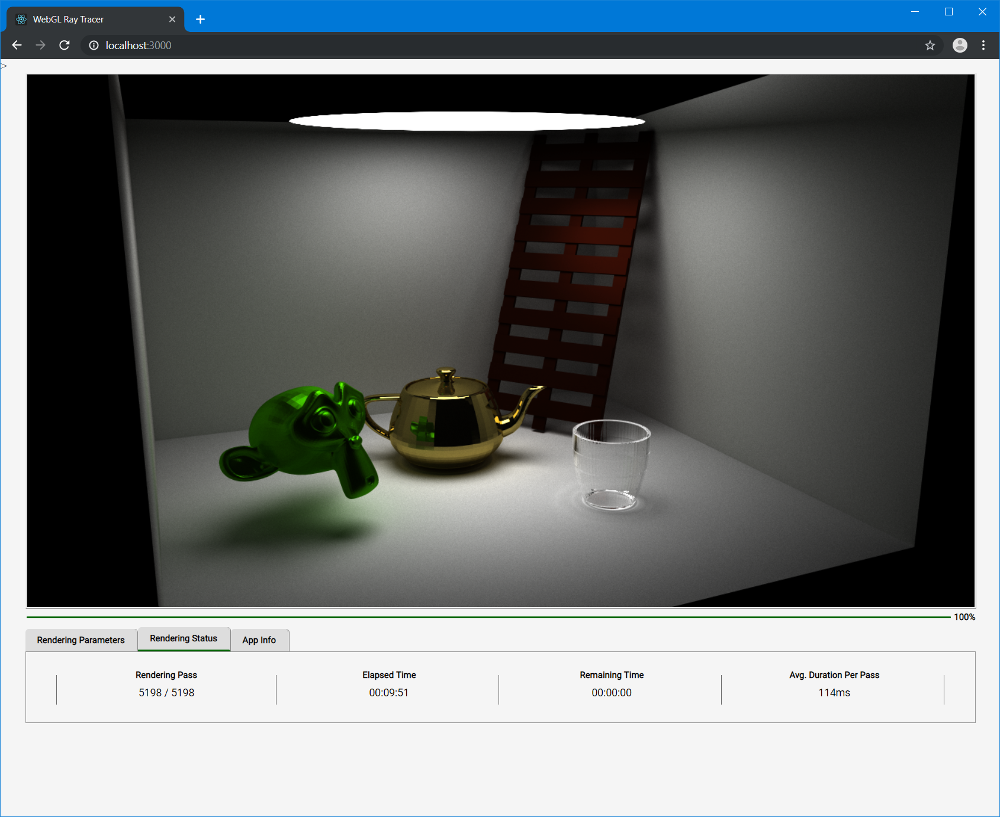
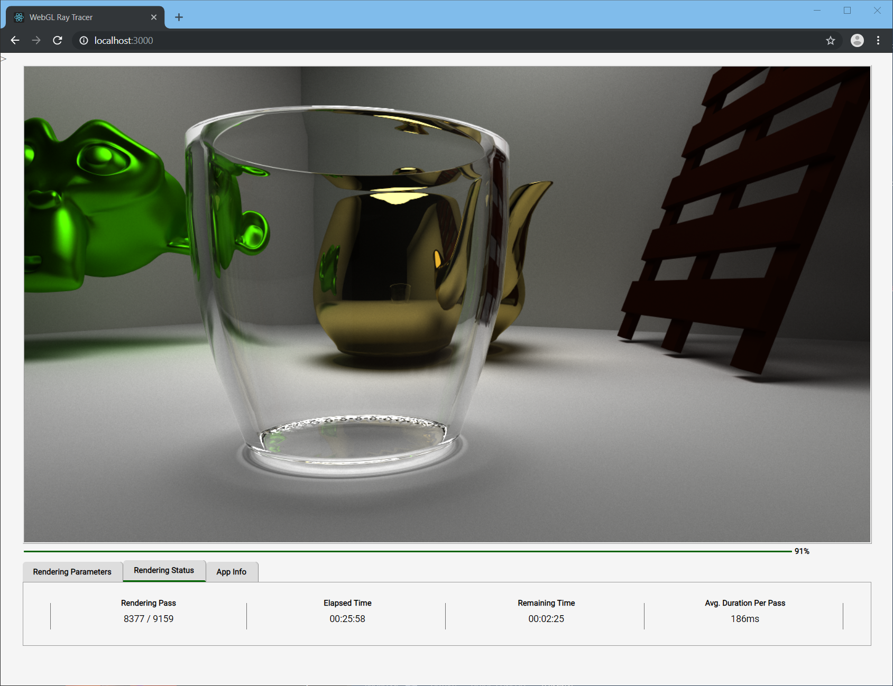
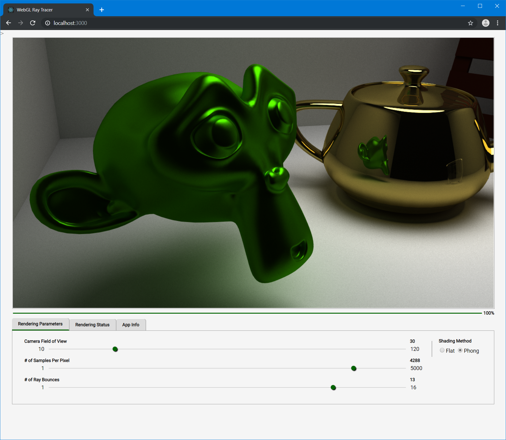
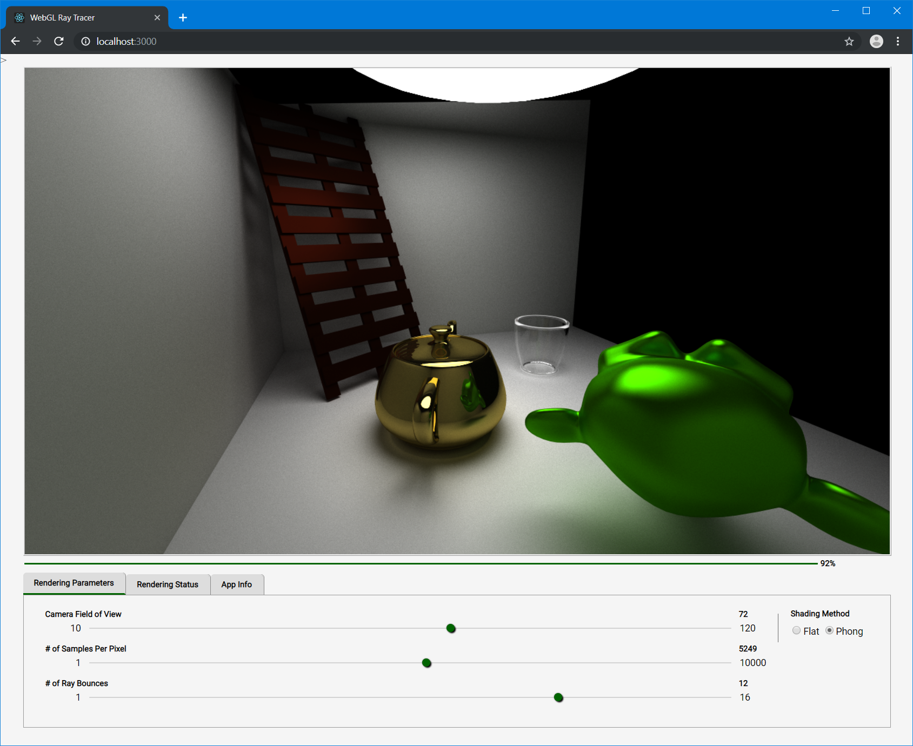

# WebGL Ray Tracer

## Hardware and Browser Compatibility

You can view this app live at [https://webgl-ray-tracer.orky.net](https://webgl-ray-tracer.orky.net). Warning! It does require a reasonably powerful GPU (e.g. an Nvidia Geforce 1080) and a browser that supports WebGL 2. It's been tested on Chrome, Firefox and Safari. Development took place entirely on Linux but the app has been tested on Windows and MacOS as well.

## Game Developers Conference

I attended a talk given by Eric Haines at GDC 2019 titled 'A Fast Forward Through [Ray Tracing Gems](http://www.realtimerendering.com/raytracinggems)'. Real-time ray tracing was a hot topic at GDC 2019 and Peter Shirley's series of tutorials with regards to [writing a ray tracer in just one weekend](http://in1weekend.blogspot.com/2016/01/ray-tracing-in-one-weekend.html) was mentioned in passing. Very much inspired by what I'd read in those tutorials, I started working on this project in my spare time to see if I could write a ray tracer for the World Wide Web. Ideally, I wanted to utilize the awesome compute power of the GPU via a fragment shader, which fits the task of tracing rays in parallel almost perfectly.

At the end of the day I ended up with what's called a path tracer. It requires a large quantity of rays to be fired through each pixel in a stochastic manner for convergence thus removing noise from the rendered image. It's a brute force technique and you pay for it in terms of time and compute power but it does produce incredibly accurate visuals like soft shadows, ambient occlusion and blurred reflections. These effects are difficult to achieve using a real-time 3D rasterizer but here you essentially get them for free with little to no rendering tricks involved.

## Development Framework

This project started in 2019 and after a long hiatus, in Nov 2024, I decided to refactor the code to take advantage of these latest packages:

- Node 22.11
- Next.js 15
- React.js 18
- Redux.js 5
- Redux Toolkit 2.3
- Typescript 5

Next.js is new to the project and even though I don't use all of its features e.g. SSR, what it offers, especially out of the box is incredibly useful. In addition, I spent a bit of time trying to eliminate UI latency by adding a web worker. But when that didn't pan out the solution was to simply pause rendering when interacting with controls in the window. Lastly any css-in-js code has been discarded. My preference these days is for css modules via scss files (Sass), which is a popular choice for good reason. I've also switched over to using yarn 4.5.1 instead of npm which is more performant while delivering fewer hiccups.

## Technical Details

This app makes use of several features that were introduced in WebGL 2 including:

- Removal of loop restrictions (very important).
- Use of new texture formats to hold random seed, mesh, material and BVH data.
- Texture arrays to store multiple BVH trees.
- Direct texel lookup using texelFetch.

The Javascript portion of the app reads Wavefront OBJ and MTL files, creates one or more BVH trees before pushing all this data on to the GPU. It's other purpose is to handle user input and user interaction with the camera.

The sample-fs.glsl fragment shader is the heart of the program. It handles:

- Pseudo random number generation.
- Bounding volume hierarchy traversal.
- Ray to AABB intersection testing.
- Ray to triangle intersection testing.
- Barycentric coordinates.
- Recursion (via looping).

The fragment shader is used to progressively build the final image via multiple rendering passes. It's done this way so the browser doesn't kill the program thinking it's gone rogue, which would happen if the shader took too long to finish. A nice bonus is it also allows a decent level of real-time interaction to be programmed in.

Enjoy!

Kam.
